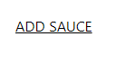

# Projet Piiquante

## Description du projet :
Piiquante est un site d'avis(Notes) sur différentes sauces piquantes postées par ses utilisateurs. 

## Installer et Éxeécuter le projet :
1. Cloner le repos git :
  - Rendez vous sur [ce lien](https://github.com/KentinTL/Piiquante)
    - Cliquer sur le bouton vert  et sélectionné la manière avec laquelle vous souhaitez cloner le repos (par zip, via GitHub desktop ou avec les commandes du Terminal)
2. Installer les dépendances :
  - Naviguez jusq'a la racine de votre projet ce qui vous donnera ceci ``` PS C:\Users\userId\Documents\Code\Piiquante> ``` par exemple.
    - Continuer de naviguer ensuite vers le dossier front-end ``` cd front-end/ ``` ce qui donnera ``` PS C:\Users\userId\Documents\Code\Piiquante\front-end> ```
      - Effectuez dans ce dossier un ``` npm install ``` une fois la commande éxecuté nous passerons à la suite.
        - Executez le front-end avec la commande ``` npm run build ``` Si pas d'erreur rendez-vous sur votre navigateur à l'adresse suivante [http://localhost:4200/login](http://localhost:4200/login)
    - Retourner en arrière vers le dossier back-end ``` cd ../back-end/ ``` ce qui donnera ``` PS C:\Users\userId\Documents\Code\Piiquante\back-end> ```
      - Créer un dossier images car le c'est dans celui-ci que les images de l'application seront stockées
        - Effectuez la aussi dans ce dossier un ``` npm install ``` une fois la commande éxecuté nous passerons à la suite.
          - Créer un fichier .env dans lequel vous allez écrire ces variable d'environnement : ``` PIQUANTE_MONGO_ID=oc-qtl-piiquante (retour à la ligne ici) PIQUANTE_MONGO_PWD=SYCfr3EIS32e7IAz ```
          - Executez le back-end avec la commande ``` node server ``` Si aucune erreur (affichage de ces 2 lignes dans la console: Listening on port 3000, Connexion à MongoDB réussie !) alors l'application est prête à être utilisée FÉLICITATION

## Que pouvez vous faire sur Piiquante ?
* Vous pouvez vous inscrire, puis vous connecter
* Une fois inscrit ou connecté vous pouvez accéder à la liste des sauces éxistantes.
* En cliquant sur Add Sauces  Vous pourrez ajouter une sauce de votre choix, attention à bien remplir tous les champs.
* En cliquant sur une des sauces de la liste vous pouvez avoir accès à des caractéristique plus détaillés ainsi que la possibilité de liké ou disliké celle-ci.
* Si vous êtes le créateur de la sauce alors vous pourrez aussi en modifié les détails (ceux demandé lors de la création)